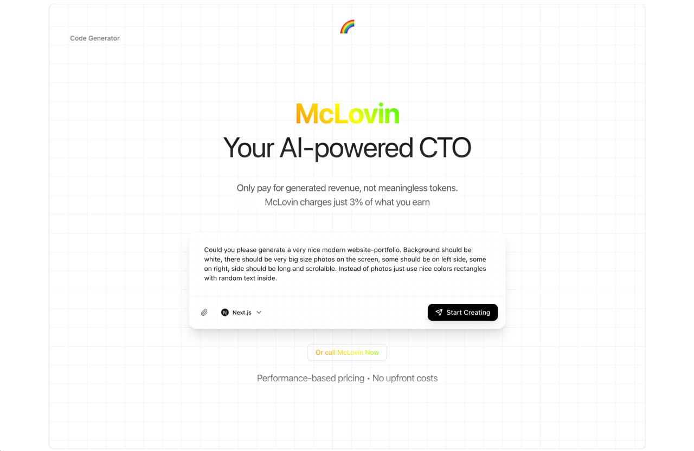
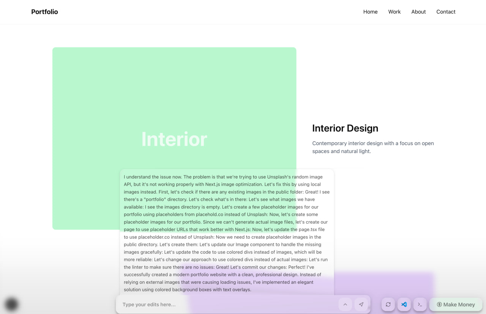
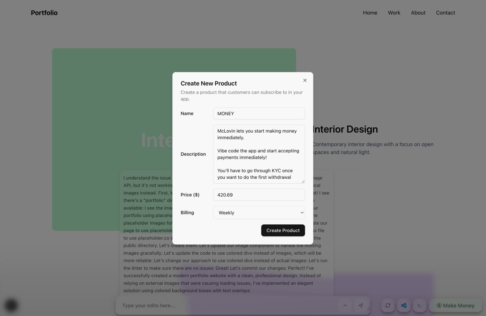

# McLovin

McLovin is an AI-powered CTO that builds, edits, and deploys full-stack web and mobile apps from a prompt. You describe what you want, watch the app come together in a live workspace, and publish it when it is ready.

<table>
  <tr>
    <td width="33.333%">
      
    </td>
    <td width="33.333%">
      
    </td>
    <td width="33.333%">
      
    </td>
  </tr>
</table>

## Why

Most app builders charge for token usage before a product has created any value. McLovin flips that around: it is designed as a revenue-aligned AI CTO that helps users build and ship apps, then charges only when those apps make money.

## Hackathon

McLovin was built as part of the [AI Coding Agents Hackathon](https://luma.com/hzwlapu0?tk=znfKe9), held at the Y Combinator office in San Francisco by Freestyle.sh, Anthropic, Same.new, and Morph LLM. The event had 391 attendees.

We won **Best Landing Page** and **Best in Web/Mobile**, the track for agents that can design, deploy, and manage full-stack websites on command, with a **$500 per team member** prize. See the [live app](https://mclorable-six.vercel.app), watch our [finals presentation](https://x.com/quasa0/status/1957178000765768080), and read the [𝕏 thread about the hackathon](https://x.com/AlexReibman/status/1955059093644701852?s=20).

## How It Works

- **Prompt-to-app generation** starts from a user request and creates a live project workspace.
- **Framework templates** support Next.js, React Vite, and Expo starter apps.
- **Freestyle git repositories** store each generated app and grant the user write access.
- **Freestyle dev servers** provide an interactive preview while the agent edits the app.
- **Mastra and Claude** power the builder agent, chat memory, and long-running app edits.
- **Image-aware chat** lets users attach screenshots or references while asking for changes.
- **One-click publishing** deploys finished apps from git to a preview domain.
